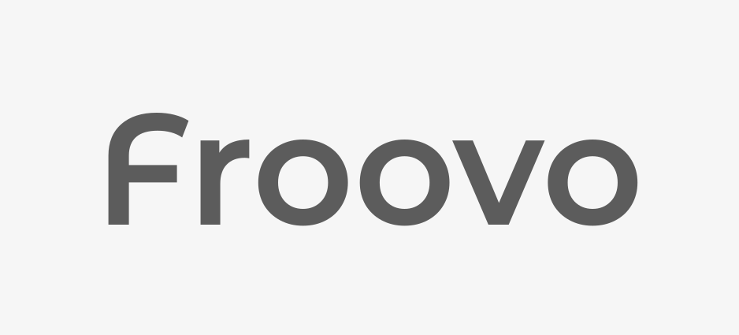

# Froovo



**Froovo** is a lightweight, fast and modular web server designed for modern applications. It is built in TypeScript and optimized to deliver high performance with a simple yet powerful architecture.

**Froovo** leverages a library written in C++ (based on uWebSockets.js) to achieve exceptional speeds and high efficiency in connection handling. Its main goal is to simplify development on this technology, adding practical functionalities and key enhancements to facilitate the creation of robust and scalable applications.

**This project has a [Code of Conduct](./CODE_OF_CONDUCT.md).**

---

## Table of contents

- [Installation](#installation)
- [Features](#features)
- [Quick Start](#quick-start)
- [Philosophy](#philosophy)
- [Examples](#examples)
- [Contributing to Froovo](#contributing-to-froovo)
- [People](#people)
- [License](#license)

---

## Installation

Before installing, make sure you have a compatible version of Node.js (≥ 18). If this is a brand new project, initialize your `package.json` with:

```bash
npm init -y
```

**Install via Git:**

```bash
git clone https://github.com/kkokotero/froovo.git
cd froovo
```

**Install from npm:**

```bash
npm install froovo
```

---

## Features

- **High performance** — ideal for modern APIs and real-time services.
- **Modular and clean** — organized, easy-to-maintain structure.
- **HTTP helpers** — redirects, efficient file delivery, streaming, etc.
- **Robust routing** — secure, configurable routes.
- **Built‑in WebSocket** — simple, efficient handling of bidirectional connections.
- **Superior throughput** — up to 10× faster than Socket.IO and 8.5× faster than Fastify.

---

## Quick Start

```ts
import froovo, { Request, Response } from "froovo";

const app = froovo();

app.get("/", (req: Request, res: Response) => {
    res.end("Hello, World!");
});

app.listen(3000, () => {
    console.log("Server is running at http://localhost:3000");
});
```

---

## Philosophy

Froovo is inspired by speed, clarity, and minimalism. Each component is simple, predictable, and easy to extend, without heavy framework dependencies.

Our goal is to provide just what you need to maximize performance and efficiency.

---

## Examples

In the `examples/` folder you’ll find various use cases; here’s a WebSocket example:

```ts
import { Server, Socket } from "froovo";

const app = new Server();

app.ws("/chat/global", {
    open(ws: Socket) {
        ws.subscribe("room:global");
        ws.send("Welcome to the global chat!");
    },
    message(_ws: Socket, data: ArrayBuffer) {
        const text = new TextDecoder().decode(data);
        console.log("Received message:", text);
    },
});

app.listen(3000);
```

---

## Contributing to Froovo

All contributions are welcome! You can help with:

- Bug fixes and performance improvements
- Documentation and examples
- Additional tests
- Triage of issues and pull requests

See the [Contributing Guide](CONTRIBUTING.md) for more details.

---

## People

- **Lead author:** [kkokotero](https://github.com/kkokotero)
- **Contributors:** see the full list at [Contributors](https://github.com/kkokotero/froovo/graphs/contributors).

---

## License

MIT License © [kkokotero](https://github.com/kkokotero)

[CODE_OF_CONDUCT]: ./CODE_OF_CONDUCT.md
